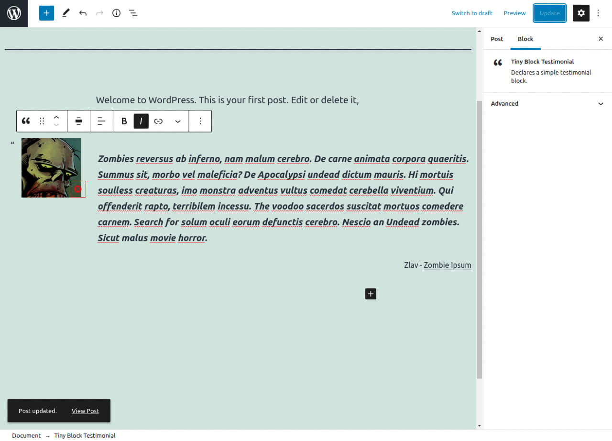
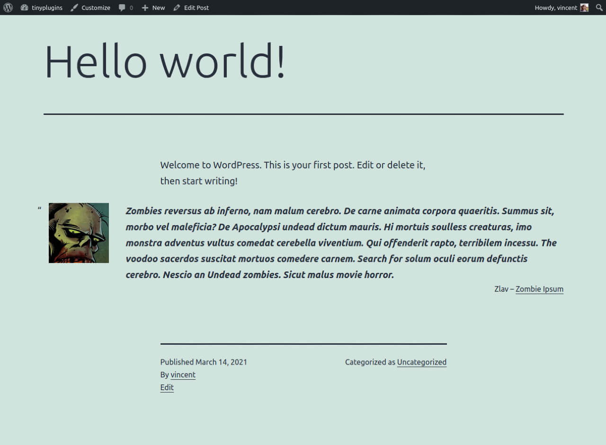

# Tiny Block Testimonial

This plugin registers a simple testimonial blockquote block, with image, quote, and author fields.

## Installation

1. Upload the plugin files to the `/wp-content/plugins/tiny-block-testimonial` directory, or install the plugin through the WordPress plugins screen directly.
1. Activate the plugin through the 'Plugins' screen in WordPress

## Basic usage

Upon activation, a new testimonial block is available in the WordPress editor.

You can find it using `/tiny` or `/testimonial` in a new block, or in the block inserter.

Just upload an image, write the testimonial, and fill in the author name. You can add a link, of format as you need.

Minimal CSS is used, mainly to make it responsive. It inherits from all of your theme styles.

## Frequently Asked Questions

### There are no plugin options. Is it normal ?

Yes, this plugin only registers a single block for use in the WordPress Editor.

== Screenshots ==

1. Find the block in the edit screen by typing /tiny or /testimonial on a new line. Just upload an image, fill in the quote, and the author name.
2. The block supports text alignment and block alignment.

== Changelog ==

= 1.0.0 =
* Initial Release